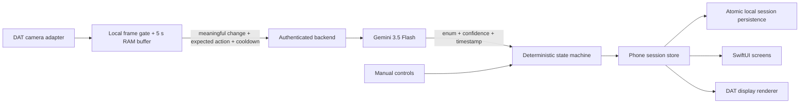

# Sous · Cooking Glasses

A native SwiftUI MVP for an AI sous-chef on iPhone and Meta Ray-Ban Display glasses. The repository was empty when implementation started. The phone owns recipe state and persisted timers; camera observations are validated evidence, never application commands.

## Open and run

Open **CookingGlasses.xcodeproj**, select the **CookingGlasses** scheme, and run on an iPhone simulator. The app starts with mock glasses and mock AI enabled. No credentials or hardware are needed for that demo.

- iOS 17.2 minimum; built with Xcode 26.6 / Swift 6.3.3, Swift 5 language mode.
- Meta Wearables DAT is pinned to **exactly 0.9.0** in the project and `Package.resolved` (commit `9b1b83d791dfebff7afd452e924a256819094b64`).
- The Foundation-only `CookingCore` package can be tested independently of Xcode, DAT, and hardware.
- The generated Xcode project is checked in. Optional regeneration: install Ruby `xcodeproj` and run `ruby scripts/generate_project.rb`.

## First complete mock demo

1. Tap **Start Recipe → Pan-Seared Chicken → Start cooking**.
2. Mark **Season chicken** and **Heat the pan** done. The current step is now **Add chicken to the pan**.
3. Open the sliders button (**Debug & settings**) and tap **Start Cooking Watch**. Leave **Mock AI Events** enabled.
4. Tap **Chicken Added To Pan**. The placement completes, the recipe advances to the first side, and exactly one five-minute timer starts. The on-phone glasses preview shows the same source state.
5. Tap it again: the unexpected/duplicate event is ignored, without restarting the timer.
6. Tap **Chicken Flipped**. The first-side timer completes and a four-minute second-side timer starts, even if the first timer had not expired.
7. Tap **Simulate disconnect**, then **Connect / reconnect**. Cooking state and timer deadlines survive. Watch remains paused until explicitly restarted.
8. Relaunch the app and **Resume Cooking**. Absolute timer deadlines restore from disk; Watch never starts automatically on launch.

Try the 60% confidence event at the placement step to see the confirmation prompt. Use **Undo** or **Correct recipe state** to repair a mistake. Previous/Next browse cards only; they never complete a step or create a timer. Completion and AI events still require valid prerequisites.

Use **Add another timer** on the cooking screen for pasta, sauce, or a side dish. Up to eight extra timers can coexist with recipe timers and keep running across ordinary step completion. All timers persist; the glasses prioritize the nearest active deadline.

## Architecture



| Area | Files / behavior |
| --- | --- |
| Core | `Sources/CookingCore`: typed recipes/events, prerequisite/evidence checks, revision guard, correction, one-action undo |
| Timers | Absolute deadlines and persisted pause state; multiple simultaneous timers; expiry only prompts a check |
| Phone | `iOS/Views` + `iOS/Stores`: Home, recipes, cooking, timers, correction, diagnostic frame preview and controls |
| DAT | `MetaWearablesService` isolates registration, permissions, connection, session, camera and display lifecycles |
| Display | Short native-text cards, transient action/Undo cards, nearest timer, expiration controls; no font shrinking |
| Vision | Configurable local gate, 32×32 luminance difference, bounded JPEG sequence, authenticated HTTPS client |
| Backend | `backend`: dependency-free Node HTTP service, Gemini key only on server, validated structured observations |

The camera initially requests low-resolution 7 fps. A bounded adapter gate converts at most 2 fps. Local sampling defaults to 1 fps normally, 2 fps when expecting an action, and one sample per 3 seconds while waiting without continuous attention. AI requests have an eight-second cooldown and only one request in flight. A sequence contains 2–8 frames within five seconds. The simple image difference gate is a prototype: head movement, lighting, and subtle actions can cause false triggers or missed detections; hardware tuning is still needed.

Navigation/correction/undo invalidate in-flight analysis. Requests also carry a captured session ID and revision at the store boundary. Observations are checked for enum, confidence, event expectation, prerequisites, duplicate evidence and plausible timestamps before they can start timers.

## Physical glasses and live Gemini

- Follow [DAT setup and exact API reference](docs/DAT_0.9.0.md). It lists every verified 0.9.0 symbol and the physical acceptance checks. Use your signing team and Meta registration configuration; the checked-in `MetaAppID = 0` is for Meta Developer Mode.
- Follow [backend setup](backend/README.md). Configure `GEMINI_API_KEY` and `COOKING_API_TOKEN` on the server; terminate HTTPS before exposing it to an iPhone.
- In app Debug settings, enter the complete HTTPS `/v1/cooking/observe` endpoint and your backend bearer token. The token is memory-only. Turn off **Mock AI Events**, select physical glasses, connect, then explicitly start Watch.
- Gemini is called with model `gemini-3.5-flash`. No live paid requests or deployment were performed during implementation.

## Verification

```sh
swift test
cd backend
npm test
npm run check
```

With Xcode installed but Command Line Tools selected, prefix Swift/Xcode commands with `DEVELOPER_DIR=/Applications/Xcode.app/Contents/Developer`.

```sh
xcodebuild -project CookingGlasses.xcodeproj -scheme CookingGlasses \
  -destination 'generic/platform=iOS Simulator' CODE_SIGNING_ALLOWED=NO build
```

Run **Product → Test** on an available iPhone simulator for the full UI workflow. Core tests cover duplicate/stale observations, confidence confirmation, prerequisites, navigation, correction/undo, pause/resume/extension, persistence and expiry. Backend tests use injected upstream responses and synthetic images, without spending API credits. See [validation notes](docs/VALIDATION.md) for the actual executed results and remaining physical checks.

## Privacy and safety

Cooking Watch requires an explicit user start. Frames stay in a small RAM buffer; there is no video recording or frame persistence. The optional diagnostic thumbnail is memory-only and cleared when disabled or monitoring stops. Stopping/backgrounding preserves cooking state and timers and stops camera capture. The backend does not store or log camera payloads. Google still processes submitted images under the provider/account terms described in the backend documentation.

Timer expiration never declares food cooked or safe and never automatically completes a recipe. Chicken instructions require a food thermometer reading of **165°F / 74°C**, consistent with [FoodSafety.gov](https://www.foodsafety.gov/food-safety-charts/safe-minimum-internal-temperatures).

## Scope still requiring follow-through

- Physical Meta glasses: pairing, permissions, real streaming, button interactions, layout, reconnect behavior, thermal/battery performance, and actual event accuracy.
- Live Gemini: deploy/configure the backend, then evaluate real cooking sequences and tune thresholds.
- **Scan Fridge** is an ingredient-selection fallback that suggests the bundled recipes; fridge photo recognition is not implemented in this cooking-flow MVP.
- Notifications are scheduled locally when permission is granted. Phone-locked delivery and physical-glasses alerts need device testing.
- The backend uses a shared demo bearer token and per-process limits; production multi-user identity and infrastructure are outside this MVP.
